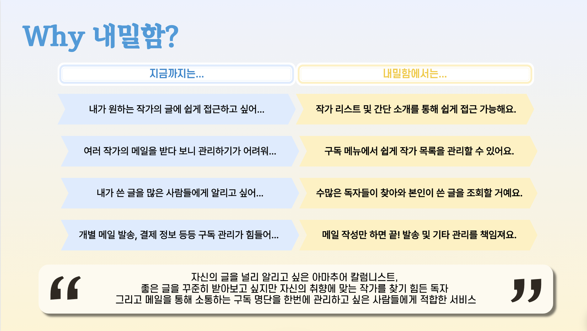
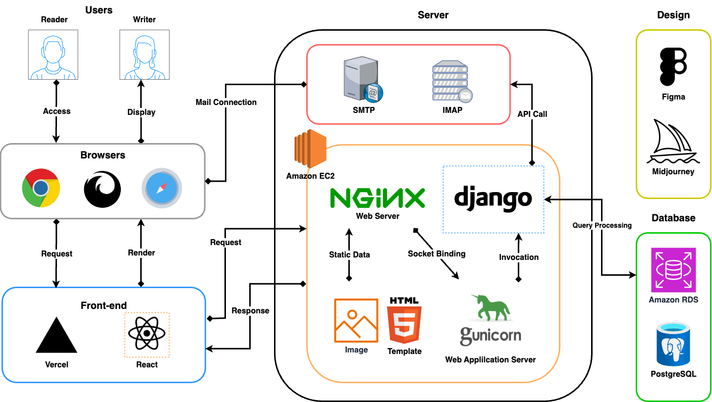
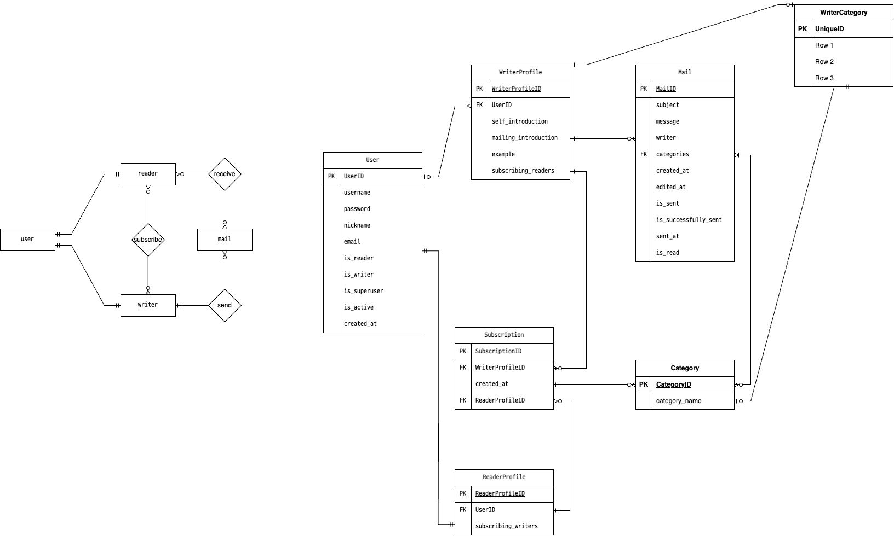

## 📬 내밀함 백 레포지토리

_Published Domain(Web)_:
https://naemilham.store/

### Table of Contents
1. [프로젝트 소개](#Project-Overview-&-Views)
2. [사용 기술](#Tech-Stacks)
3. [서버 구성도](#Architecture-Diagram)
4. [ERD](#ERD)
5. [사용한 컨벤션](#Conventions)
6. [팀원 구성](#People)

### Project Overview & Views

> 디지털 세계 중 가장 아날로그스러운, 당신만을 위한 편지를 메일링 서비스로 받아보세요.

원하는 작가의 글을 구독을 통해 정기적으로 받아보고 싶은 독자, 자신의 글을 다른 사람들에게 널리 알리고 싶은 작가 모두를 위한 프라이빗 메일링 구독 서비스 플랫폼 내밀함을 소개합니다.

다양한 취향의 개인이 원하는 양질의 컨텐츠 탐독 수요의 증가에 맞춰 개발된 내밀함 서비스는 인스타그램, 블로그 등 파편화되어있는 메일링 소통 창구를 한번에 관리할 수 있습니다. 또한 보내는 이/받는 이 특성에 맞게 구분된 페이지 및 정보 관리 탭을 통해 구독 추가 및 삭제, 일괄 메일 전송 및 구독 정보 관리 등을 손쉽게 진행할 수 있습니다.

***Main Features***
- 회원가입, 로그인 등 기본 사용자 관리 기능
- 작가/독자 프로필 분리 및 정보 업로드, 수정
- 작가 상세 프로필 확인 및 구독/구독 취소
- 메일 작성 및 업로드
- 데이터베이스 내 구독자에게 이메일 전송
- 답장 크롤링 및 작성자 회신

### Tech Stacks

  

### Architecture Diagram

### ERD

### Conventions
- 브랜치 전략으로 `Git Flow`를 사용했습니다.
- 통일성 있는 코드 및 유지 보수 용이성을 위해 Code Formatter로 `Black`을 사용했습니다.
- 또한 pep8 코드 스타일, Import 순서 조정 등을 위해 `isort`, `flake8`을 포함한 `pre-commit-hook`을 설정했습니다.

- 원활한 작업 내역 공유를 위해 다음과 같은 Commit message convetion을 사용하였습니다.

### People
<table>  <tr>  <td></td> <td>이수혁</td> <td>이호준</td></tr> <tr> <td>GitHub</td> <td></td> <td></td> </tr> </table>
